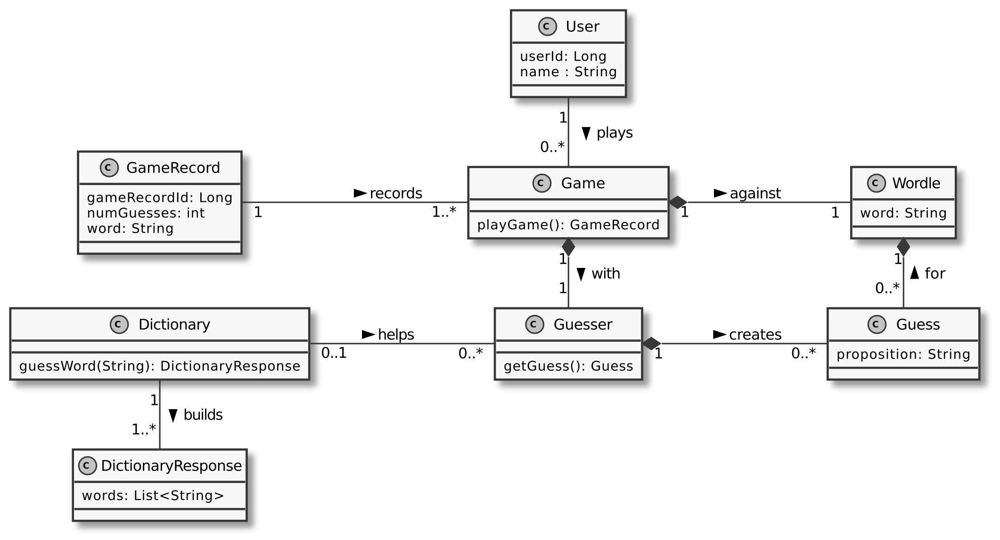

# SENG301 Assignment 5 (2022)

## Context

This material is part of the SENG301 assignment 5. It contains a series of Java
classes meant to test the student's knowledge of design patterns and set the framework for students to write acceptance tests. Please
take some to familiarise yourself with the code and its structure. It is an augmented
version of the code base used during the first
term.

This assignment is meant to create a Wordle ersatz that allows to:

- make guesses of words
- get feedback on guesses
- ask for help through an API

A partial domain model is included below



## Authors

Initial contribution by SENG301 teaching team.

## Content

```
|_ app
  |_src
    |_ main: main source folder
      |_ java: project code to be analysed and extended
      |_ resources: application resource files (e.g., hibernate, logger)
    |_ test: test folder
      |_ java: project tests (cucumber scenario implementation)
      |_ resources: test-specific configuration and Cucumber features
  |_ build.gradle: project dependencies and (build) tasks
|_ gradlew: gradle wrapper (unix)
|_ gradlew.bat: gradle wrapper (windows)
|_ LICENSE.md: this project license file (i.e. The Unlicense)
|_ README.md: this file
|_ settings.gradle: top project gradle configuration

```

See attached handout for more details on the code.

## Run the project

This project relies on gradle (version 7.3 or later). See `build.gradle` file for
full list of dependencies. You can use the built-in scripts to bootstrap the
project (`gradlew` on Linux/Mac or `gradlew.bat` on Windows).

If you have issues with the script, you can either:

- if you have gradle installed, use `$ gradle wrapper` to recreate the wrapper script
- make the script executable with `$ chmod u+x gradlew` (Linux/Mac)

To build the project, place yourself at the root folder of this project, then,
in a command line:

- On Windows: type `gradlew.bat build`
- On Linux/Mac: type `./gradlew build`

To run the Common Line Interface application, from the root folder:

- On Windows: type `gradlew.bat --console=plain run`
- On Linux/Mac: type `./gradlew --console=plain run`

The option `--console=plain` is passed to suppress part of the coloured output
of gradle that may interfere with the CLI. More details about gradle, see
[Gradle Website](https://gradle.org/).

## Copyright notice

Copyright (c) 2022. University of Canterbury

See LICENSE.md file for more details.
